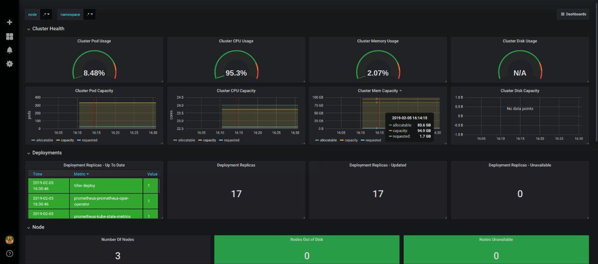

# terraform-aws-eks-grafana-prometheus

[](https://github.com/DNXLabs/terraform-aws-eks-grafana-prometheus/actions)
[](https://github.com/DNXLabs/terraform-aws-eks-grafana-prometheus/blob/master/LICENSE)


Terraform module for deploying Kubernetes [Prometheus](https://prometheus.io/) and [Grafana](https://grafana.com/) inside a pre-existing EKS cluster.

[Prometheus](https://prometheus.io/) is an open-source systems monitoring and alerting toolkit originally built at SoundCloud. Since its inception in 2012, many companies and organizations have adopted Prometheus, and the project has a very active developer and user community. It is now a standalone open source project and maintained independently of any company. Prometheus joined the Cloud Native Computing Foundation in 2016 as the second hosted project, after Kubernetes.

[Grafana](https://grafana.com/) is open source visualization and analytics software. It allows you to query, visualize, alert on, and explore your metrics no matter where they are stored. In plain English, it provides you with tools to turn your time-series database (TSDB) data into beautiful graphs and visualizations.


## Usage

```bash
module "grafana_prometheus_monitoring" {
  source = "git::https://github.com/DNXLabs/terraform-aws-eks-grafana-prometheus.git"

  enabled = true
}
```

Check if Prometheus and Grafana components deployed as expected:

```bash
kubectl get all -n monitoring-system
```

In order to access the Prometheus and Grafana server URL, we are going to use the kubectl port-forward command to access the application.

```bash
# Prometheus
kubectl port-forward --address 0.0.0.0 -n monitoring-system deploy/prometheus-server 8001:9090
```

```bash
# Grafana
kubectl port-forward --address 0.0.0.0 -n monitoring-system deploy/grafana 8001:3000
```

When logging in, use the **username** and **password** `admin`.

## Dashboards

Log in to Grafana dashboard using credentials supplied during configuration.

#### Cluster Monitoring Dashboard

For creating a dashboard to monitor the cluster:

- Click **"+"** button on left panel and select **"Import"**.
- Enter **3119** dashboard id under Grafana.com Dashboard.
- Click **"Load"**.
- Enter **Kubernetes Cluster Monitoring** as the Dashboard name.
- Select **"Prometheus"** as the endpoint under prometheus data sources drop down.
- Click **"Import"**.

This will show monitoring dashboard for all cluster nodes


#### Pods Monitoring Dashboard

For creating a dashboard to monitor all the pods:

- Click **"+"** button on left panel and select **"Import"**.
- Enter **6417** dashboard id under Grafana.com Dashboard.
- Click **"Load"**.
- Enter **Kubernetes Pods Monitoring** as the Dashboard name.
- Click **change** to set the Unique identifier (uid).
- Select **"Prometheus"** as the endpoint under prometheus data sources drop down.s
- Click **"Import"**.



<!--- BEGIN_TF_DOCS --->

## Requirements

| Name | Version |
|------|---------|
| terraform | >= 0.13 |
| aws | >= 3.13, < 4.0 |
| helm | >= 1.0, < 3.0 |
| kubernetes | >= 1.10.0, < 3.0.0 |

## Providers

| Name | Version |
|------|---------|
| helm | >= 1.0, < 3.0 |
| kubernetes | >= 1.10.0, < 3.0.0 |

## Inputs

| Name | Description | Type | Default | Required |
|------|-------------|------|---------|:--------:|
| create\_namespace | Whether to create Kubernetes namespace with name defined by `namespace`. | `bool` | `true` | no |
| enabled | Variable indicating whether deployment is enabled. | `bool` | `true` | no |
| helm\_chart\_grafana\_name | Grafana Helm chart name to be installed | `string` | `"grafana"` | no |
| helm\_chart\_grafana\_release\_name | Grafana Helm release name | `string` | `"grafana"` | no |
| helm\_chart\_grafana\_repo | Grafana repository name. | `string` | `"https://grafana.github.io/helm-charts"` | no |
| helm\_chart\_grafana\_version | Grafana Helm chart version. | `string` | `"6.1.17"` | no |
| helm\_chart\_prometheus\_name | Prometheus Helm chart name to be installed | `string` | `"prometheus"` | no |
| helm\_chart\_prometheus\_release\_name | Prometheus Helm release name | `string` | `"prometheus"` | no |
| helm\_chart\_prometheus\_repo | Prometheus repository name. | `string` | `"https://prometheus-community.github.io/helm-charts"` | no |
| helm\_chart\_prometheus\_version | Prometheus Helm chart version. | `string` | `"13.2.1"` | no |
| mod\_dependency | Dependence variable binds all AWS resources allocated by this module, dependent modules reference this variable. | `any` | `null` | no |
| namespace | Kubernetes namespace to deploy Monitoring stack Helm charts. | `string` | `"monitoring-system"` | no |
| settings\_grafana | Additional settings which will be passed to Grafana Helm chart values. | `map` | `{}` | no |
| settings\_prometheus | Additional settings which will be passed to Prometheus Helm chart values. | `map` | `{}` | no |

## Outputs

No output.

<!--- END_TF_DOCS --->

## Authors

Module managed by [DNX Solutions](https://github.com/DNXLabs).

## License

Apache 2 Licensed. See [LICENSE](https://github.com/DNXLabs/terraform-aws-eks-grafana-prometheus/blob/master/LICENSE) for full details.
